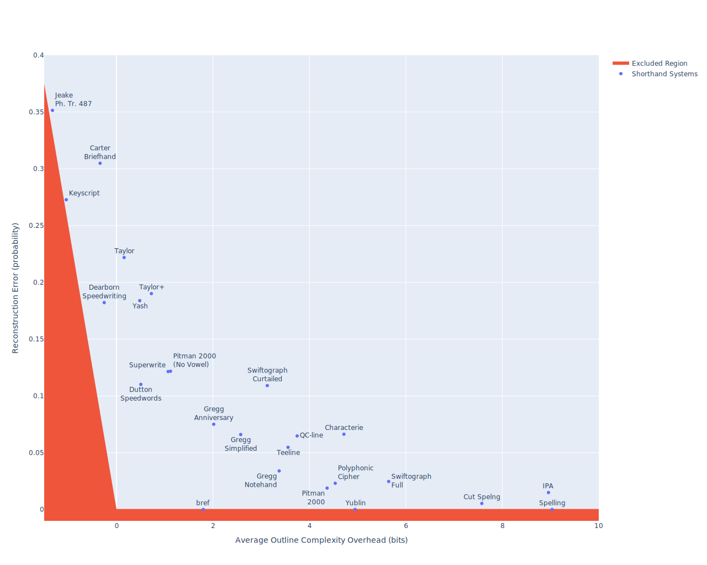

# The Shorthand Abbreviation System Comparison Project

## Background

One of the things that has always struck me as a little sad about the history of shorthand is that the mathematical techniques to really understand shorthand (namely information theory) came into existence essentially just as the shorthand itself was starting to fall out-of-fashion. In 1948, Claude Shannon established in *A Mathematical Theory of Communication* the mathematical limits of communication channels, which has lead to every fundamental technology in the modern digital era, such as data compression, error correction, efficient search, and even machine learning.

As shorthand is a method of communication, much of the theory applies directly to the study of shorthand systems.  In particular, this theory constrains what is possible in the *abbreviation systems* that underlay any system of shorthand. This document will be restricted to only compare English shorthand systems, however the techniques are not limited to English alone.

## Methods

I'll get into details later, but for right now I simply want to say enough so that this chart can be legible.  First, I'll describe the $y$-axis (the reconstruction error), and then second I'll describe the $x$-axis (the average outline complexity overhead).

### Reconstruction Error

This is, in many ways the simpler of the two to describe.  Everyone who uses shorthand knows that most shorthand systems require taking on some level of ambiguity, where a single outline in isolation need not fully determine the word.  The reconstruction error is a measure of how often you will encounter words for which the best guess at what their corresponding outline means is not the original word.  Here is the full process to compute it.

1. Select a word at random with the frequency at which they occur in the English language.

2. Convert the word into it's corresponding outline.

3. Amongst all words in the English language, find the most common one that produces that outline, this is the best guess for the reconstruction of the original word.

4. Record the probability that this best guess *is not* the same as your original word (the reconstruction error).

### Average Outline Complexity Overhead

This one is a bit more complex.  In information theory, there is a fundamental quantity called the Shannon entropy, where if you have a bunch of words with probabilities $p_i$, then the entropy is:

$$
H(p) = -\sum_{i=1}^\infty p_i \log_2(p_i).
$$

The most important thing here is that the entropy tells you the smallest number of bits on average to send a message without errors.  

Thus, to compare systems what we can do is find the *optimal* cost of encoding the sequence of symbols provided by the shorthand system's theory into bits, and then see how this relates to the minimal values computed by the entropy of the dictionary of English words.  So, symbolically, if the optimal cost of encoding a shorthand outline into bits has $l_i$ bits, the *average outline complexity overhead* is defined as

$$
O(p) = \sum_{i=1}^\infty p_i (l_i + \log_2(p_i)).
$$

There are some subtleties here in how it was implemented (for instance I use the entropy of the symbols themselves instead of finding an encoding), but this gives the gist of it.

> [!IMPORTANT]
> There is a subtlety here that is very important to understand, which is that every system comes with *its own dictionary*.  This means that the bound by the Shannon entropy is different for every system under comparison.  This is one of the reasons that we need to look at the overhead, as it appears to be more stable under shifts of the dictionary (philosophically, looking at the overhead looks at typically how close the system gets to the optimal representation of words, which is independent of the words being represented).  The most optimal solution would be to have the same 5000 words written in every system, however this is not feasible.  Currently, if you look at every system on this chart, they only share about 100 words in common between all of them.

### The Excluded Region

Now, we get into some interesting mathematics, and really one of the things that motivated me to make this chart in the first place: what happens when you send less information than the minimum defined by the entropy?  The answer is, you must inevitably start to introduce ambiguity into the system, and moreover [Fano's Inequality]() provides a limit on how large of error must be made.  This chart does not directly use Fano's inequality, but instead a simpler approximate bound of the difference in entropy divided by four.  This, while not fully precise, is independent of the dictionary, and is sufficient to give a sketch of the bound here.

Proof sketch.

This is a rough sketch of proof of this simplified version of a Fano-type inequality in this case.  We start by writing the entropy of our random word choice $W$ in terms of the random outline $O$.  By the definition of conditional entropy we have that

$$
H(W) = H(O) + H(W|O).
$$

That is to say, we separate the information of the random choice of word into the information of the random choice of outline plus the information of the random choice of words amongst those words with the given outline.  $H(W)$ and $H(O)$ are known, so this tells us that $H(W|O) = H(W) - H(O)$. We will assume that this difference is small.

Now consider the random variable $C$ which records if the reconstruction was correct or not (which is a deterministic function of $W$ and $O$).  Thus, we have that $H(C|O) \le H(W|O)$ by the data processing inequality.  Let $p_c$ be the probability that the reconstruction is correct.  If we assume that the difference in entropy is not larger than one bit, then we know that $p_c$ must be larger that $1/2$.  Since $C$ is a binary event, we can lower bound the entropy with the quadratic bound $4p_c(1-p_c)$.  Expanding in a linear approximation around $p_c \approx 1$ we have that this is approximately $4(1-p_c)$, and thus that $4(1-p_c) \le H(W) - H(O)$. This can be rearranged to show that $p_c \gtrsim 1-(H(W) - H(O))/4$.

## Lessons

### There are two kinds of shorthand systems

This was for me the biggest lesson of this project, and I think is a legitimately useful way to assess shorthand systems: there are in practice two kinds of shorthand systems, those that attempt to minimize error (Gregg, Pitman, T-Line, and most other similar systems live here and in my figure they cluster along the bottom red area) and those that attempt to minimize length at the expense of errors (Taylor, Yash, Speedwriting, and most typeable shorthand systems live here, and they all tend to cluster along the left-hand line).  

This need not be the case: one could build a shorthand system that is bad at both, however the fact that these authors relentlessly optimized their systems means that they have been driven to the boundaries of what is mathematically allowed, and since the region that is mathematically allowed is defined by two lines, the shorthand systems themselves follow suit.

I think many people feel this one.  What it means to write in Keyscript versus Gregg is wildly different even if you ignore the fact that one is written and the other typed.  Keyscript feels highly ambiguous (because it is), but at the same time feels usable since it is so efficient (indeed only one of two systems where my analysis places it as mathematically impossible to have no errors it is so brief).

### Brief forms are almost inevitable

From this analysis, brief forms are an essentially unavoidable tool to use when trying to optimize these two things.  The reason for this is simple: for any system you have that is not the perfect system (so either has non-zero error, or has greater than the minimum possible outline complexity) you can always improve at least one of those metrics without making the other worse by introducing one or two more brief forms (the two is required if one wants to formally prove this, as sometimes you'll need to swap how two words are represented).  

Part of this is obvious to everyone in the shorthand community: of course brief forms let you make outlines shorter, that's what it is there for!  Indeed, that is true, but what at least I never realized is that brief forms can also be a tool of disambiguation.  For instance, in Taylor the fact that "to" is briefed to just "t" and "toe" is not, allows the system to actually become less ambiguous through the addition of briefs.  Sadly, not all briefs are of this type, so Taylor briefs actually increase the error rate by about 4% in total.

These feature, that literally *any* shorthand system can be made better by at least one, if not both, of these metric simultaneously by the addition of brief forms is part of why I believe they are unavoidable in shorthand systems.  Once your abbreviation principles have taken advantage of as much of the regularity of the language as possible, you can always add on briefs to make it better.

It is entertaining, and illustrative to take this to the extreme.  Take all the words in the English language, and line them up in *decreasing* frequency.  Then, similarly establish some way of representing your shorthand characters, and order all possible shorthand outlines in *increasing* order of complexity.  Now, match these up in order, that is simply assign the simplest outlines to the most common words.  This can be shown to be the optimal solution, and lives in that perfect "zero error, minimal length" corner.  All you need to do is memorize a few hundred thousand brief forms...

## Limitations

This immediately means there are many parts that this theory cannot touch.

1. **Speed.** I want to get this one out of the way immediately.  While the efficiency of an abbreviation system is indeed directly relevant for the speed at which a shorthand system can be written, it is not the only factor.  Most obviously, it doesn't actually address the actual writing of symbols on a page.  I will get into more detail later, but essentially it assumes that all symbols are optimally written, but that simply is not so: nobody has ever claimed that a Forkner "s" can be written in the same time as a Gregg "s"!  The speed of a system is a complex mix of the underlying abbreviation system along with the assigned strokes, and human biomechanical limitations.  I want to assert with no ambiguity here: **The only way to understand the speed of a shorthand system is to train skilled practitioners and measure their performance.**

2. **Legibility.** Every-so-often, you see someone create a shorthand system with some idea like: give every letter one of 26 distinct angles.  Such systems are completely unusable since people cannot distinguish 26 distinct angles, nor reliably write them.  Again, this is related to human factors, and no mathematical theory can completely account for them.

3. **Ambiguity.** While much of this work can inform and provide worst-case bounds on how ambiguous a shorthand system is, it cannot fully answer the questions of how ambiguous a system is.  First, it does not consider the *severity* of confused words.  A shorthand system that confuses *legal* and *illegal* is a far worse than a system that confuses *legal* and *algal*, as context can almost always distinguish the second, and almost never distinguish the first.  Second, it does not consider context at all.  It is easy to imagine systems which look decent by these two metrics, but for which context queues are essentially useless (for instance, a system that gives optimal brief forms for the first few hundred words, but then writes all rare words with a single dot).

4. **Memory Load and Reading Difficulty.** There is nothing this theoretical analysis would love more than a exhaustive list of perfectly chosen brief forms for every word in the English language.  Such a system can be astonishingly brief and unambiguous, however it is near-impossible to learn, or read (as, for instance, the briefs of "run" and "running" are not necessarily similar).  These are again dominated by human factors, and so are hard to make fully mathematical.  There is a human character to "how hard is this to learn" that cannot just be plotted on a graph.

5. **Phrasing.** This is not a fundamental limitation, but it is a limitation of the current implementation, but phrasing is not considered in this analysis.  This relates to the *Mathematical Caveats* section below, but this analysis ignores the cost of putting spaces between words.  This is not fully accurate for a number of reasons, but it means that running an analysis of phrasing is not impactful at this time, and would only serve to make this even more complex.

6. **Positional Information.** Similar to phrasing, since the space between words isn't counted in this implementation, positional information isn't properly accounted for as it is essentially different types of spaces.  I've included it for systems where it is important like Pitman, but this is overly penalized in terms of outline complexity. 

## Comments on each system

At this point I want to leave a few comments on each system, particularly around how reliable I consider the data used to place it on the chart.

### Spelling

> [!Tip]
> This data is the baseline for all other comparisons, the frequency data is imperfect containing many nonsense words, but it is obtained from the [Google N-Grams Dataset](https://github.com/orgtre/google-books-ngram-frequency/blob/main/ngrams/1grams_english.csv).

Spelling is, of course, not a shorthand system.  It is, however, the basis of everything that we do here as it is the lowest error rate representation of words that exist.  Words like "read" in the sense of "I will read that book," versus "read" as in "I read that book yesterday," will still be conflated, however the consensus I could find (sadly without proper citation) is that it is less ambiguous than spoken English as it can disambiguate "read" form "reed" and "read" from "red" and "right" from "write".  

Partially due to this feature, however, it is notoriously inefficient, writing words like "through" or "aitch" for words of three and two sounds respectively.

### IPA Spelling

> [!Tip]
> This is provided by a fairly high-quality [dictionary of IPA spellings](https://github.com/open-dict-data/ipa-dict/blob/master/data/en_US.txt).  It should be considered fairly high quality.

IPA Phonetic spelling aims to accurately reflect the sounds of words.  In particular, it is rather attentive to representing the space of possible vowel sounds, far more than is done in normal spelling.  Mostly due to this feature, it is less efficient than normal spelling, and has the errors inherent in any phonetic system.  

The most important thing to know about it on this chart is that it is essentially the lowest error that any phonetic system can achieve, as it aims to fully accurately capture the sound of the word.

### Cut Spelng

> [!Tip]
> This is provided [this dictionary](https://github.com/DanielTillett/CutSpel/blob/master/cutspel.csv).  It should be considered fairly high quality.

[Cut spelng](https://en.wikipedia.org/wiki/Cut_Spelling) is a fairly recent English spelling reform introduced in 1992.  It provides a small number of rules to remove some redundant letters in English and move it closer to a phonetic system.  A few examples are: "fotograf" (photograph), "juj" (judge), "flyt" (flight). 

While not a shorthand system itself, things like [One Stroke Script](https://drive.google.com/file/d/1HFL0gPj7iTz_ENWGs3EUcEXcU4bJxvDF/view?pli=1) use it to create mid-hand systems.

It is fairly compelling as a potential basis of a shorthand system as it is significantly shorter than traditional spelling, while also introducing very few confusions not inherent already in English spelling and being closer to phonetic.

### Pitman 2000

> [!Caution]
> This should be treated with suspicion.  Due to the omission of an explicit space character, over penalizes Pitman's use of position.  Additionally, I don't know Pitman as a system, the dictionary is somewhat machine generated (although I am deeply indebted to the author for providing the underlying dictionary to make this analysis possible), and Pitman dictionaries always record the full representation of the word, which is never what stenographers use at speed.  Also, this Pitman dictionary does not provide expressions for the briefs but instead treats them like arbitrary characters. 

I'm going to reiterate again here to make sure it is seen: these dots should not be trusted!  However, it shows an interesting enough picture that I wanted to include them.

First off, note that the fully represented Pitman 2000 is no more ambiguous than IPA itself, but is vastly more brief!  Pitman created his system to be an efficient way to write spoken words exactly.  It certainly does exactly that, achieving some brevity through extensive attention to efficiently representing consonant clusters.

Second, when fully diesmvoweled, the system becomes even more brief than Gregg Anniversary while still having lower error rate than other fully disemvoweled systems like Taylor.  This is almost entirely due to the way it handles consonant clusters which allows the reader to infer the position of vowels even when the vowels are not written.

I think this performance is astonishing (particularly when you account for the known shortcomings of this analysis), and well earns Pitman its position as amongst the best systems in history.

### Characterie

> [!Warning]
> [This dictionary](https://characterie.neocities.org/table) was hand-created by the author over the period of several months.  I trust it well.  However, Characterie also has positional information (rotations of identical characters) that is again improperly represented here, so it should be briefer than this chart indicates.

Characterie is the oldest English shorthand system in existence.  It is founded on a completely separate principle than any other system, where you first select a synonym, antonym, or a category the word belongs to from a list of approximately 500 words, and then writes a special symbol for that word along with the first letter or two of the original word.

Based upon this, I assumed that it would be briefer than it is, and also that it would have much higher error rates.  I was shocked to see it instead seems to have error rates on-par with highly optimized systems like Gregg Simplified!  Had I not created the dictionary laboriously myself checking each word by hand (which took me a few minutes), I would doubt the result, however I am absolutely certain these representations are reasonable.

I'm not going to sugar-coat it: Characterie is one of the worst systems on the chart, but I still find its performance surprising!  A great showing for a system created fully without any known president.

### Yublin

> [!Tip]
> This system is fully written English except for [600 one or two letter briefs](http://jonathanaquino.com/yublin.csv).  As such the measures are essentially error free.  

Yublin is fascinating as it is basically the start of applying the mathematically perfect procedure I described above (where you sort all the words by frequency, all the outlines by complexity and match them up), just stopping when you get past all possible two-letter words.  As such, it has zero errors (the author never assigns the same brief twice), and does a lot to shorten text.  If you are a person who prefers memorizing facts, this could be a compelling component to add to your shorthand repertoire since it "just" memorizing 600 briefs with no other theory.

### A Readable Polyphonic Cipher

> [!Tip]
> This dictionary is error-free given the structure of this system.

This was not built as a shorthand, but it is an interesting system [described in this paper](https://digitalcommons.butler.edu/wordways/vol8/iss1/16/) it is a simple cipher of standard English spelling but with a twist where the same symbol is used for many letters.  

| 1 | 2     | 3     | 4     | 5     | 6       | 7     | 8     | 9     |
| - | ----- | ----- | ----- | ----- | ------- | ----- | ----- | ----- |
| e | t x z | a c q | i l b | o g j | n p k v | r y w | s f m | h d u |

This system has remarkably low error rate (approximately the same as a phonetic system) and reasonable compression rates which would be leveraged to make a shorthand since it lets you assign every letter a simple stroke.

We'll see the same idea occurred earlier in history in Jeake's shorthand, but to vastly different effect.

### QC-Line

> [!Tip]
> This dictionary is nearly error-free given the structure of this system, the only possible source of error being the system I use to disambiguate the sound of "c".

This is a modern system developed by [u/RainCritical on Reddit](https://www.reddit.com/r/shorthand/comments/1duz9n4/nline_update_results_in_an_entirely_new/).  The simplicity appealed to me, being mainly a vowel reduction system.  The rules are:

1. Replace "q" and "c" with "kw", "k", or "s" depending on sound.
2. Remove all vowels in the middle of the word, but leave the ones at the end even if silent.
3. Merge doubled consonants into one.

I was impressed to see it live in an entirely different location to Taylor.  This appears to be true for a few reasons: (i) this system is based off of spelling rather than sounds and includes things like silent "e" at the end of words, so the silent letters help disambiguate words which are merged in Taylor, and (ii) Taylor has rules that dictate that you should never write more than 5 consonants when using the system in practice.  

This again goes to show that, what may appear to be minor modifications can have incredible impact on the final performance.  In the end, QC-line's simple rules place it near Teeline in performance (a little slower, and a little more ambiguous) which is a great place to be!

### Teeline

> [!Caution]
> This should be treated with suspicion.  I don't know Teeline as a system. The dictionary, while human generated, is formatted for other humans to reference in an [Anki deck](https://ankiweb.net/shared/info/310534731) rather than machines, containing a small amount of non-standardization between examples.  For these reasons, Teeline might be over penalized by either or both metrics.

Teeline lands in a strong spot right next to the Gregg family of systems, having slightly more complex outlines than all of them, and an intermediate error level between Gregg Notehand and Gregg Simplified.  A strong system, again earning its place amongst the most popular systems in modern usage.

### Gregg Notehand, Simplified, and Anniversary

> [!Tip]
> This should be a pretty darn accurate set of data points.  Notehand is likely the most inaccurate datapoint coming from a [fairly small dictionary](https://gregg-shorthand.com/2015/09/05/notehand-dictionary/). Simplified comes from a [very nice dictionary provided by u/GreggLife](https://www.reddit.com/r/shorthand/comments/1e7ie7g/gregg_simplified_computerreadable_dictionary/), and Anniversary from a truly massive dictionary as part of [Grascii](https://github.com/grascii/dictionaries).  These are probably the most trustworthy non-trivial data points in the graph, but none are perfect.

We arrive at another one of the greats, Gregg shorthand!  I'm extraordinarily lucky to have reasonably high quality dictionaries for three versions of the system at my disposal as seeing them line up more-or-less as one would expect gave me great confidence that my measurements were done correctly.  

The most complex outlines, and lowest error goes to Gregg Notehand, a system designed to trade off simplicity for speed and reliability.  Next is Simplified, which was designed as a simplified version of Anniversary which maintained most of its performance.  Finally, Anniversary is the oldest, fastest, and most complex variant.  This narrative is repeated in my graph!

Of note is the fact that Gregg Anniversary is likely "the best" system on this chart for many people in terms of the most balanced trade off between speed and error rates.  The corner at (0,0) is the sweet spot where the outlines are as short as possible with no error, and Gregg Anniversary is pretty close.

But, philosophically, I do not actually know how Gregg achieves it!  It has a fairly robust set of abbreviation principles, but nothing remarkable.  It has some consonant blends, but again not that many, and mostly they are there to either fix issues with the strokes assigned to some common letter pairs (like "fr") or to provide some obvious improvements to common combinations (like "nt" or "ded"), but they hardly seem sufficient to explain it.  Gregg has a very large number of brief forms, but that is common to many systems.  It is hard to find a way that Gregg truly shines here, but shine it does!

### Bref

> [!Tip]
> This dictionary is error-free given the structure of this system, as presented in [the dictionary as shared on reddit by its creator u/donvolk2](https://www.reddit.com/r/shorthand/comments/esjhdk/bref_shorthand/).

This one, once plotted, absolutely needed to be included in the analysis.  Bref is, as far as I can tell, a dictionary of approximately 11K brief forms which have a series of guidelines in how they were created, but are not the product of applying abbreviation rules.  Most notably, every brief form is chosen to be unique and thus never introduces any error!  Extraordinarily memory heavy, but also essentially producing an optimal abbreviation system. The author uses is daily, so it is practical, but it likely takes a long time to learn.  No matter what, hat's off to the system creator in authoring what is, as far as I can tell, the most efficient set of brief forms ever created by any shorthand author.  

If we want to get technical, this system Pareto dominates every system discussed so far for these two metrics including every version of Gregg.  What this means is that bref both has fewer errors than Gregg Anniversary (indeed no errors), and has shorter outlines.

### Dutton Speedwords

> [!Tip]
> [This dictionary](http://www2.cmp.uea.ac.uk/~jrk/conlang.dir/Speedwords.dict) should be quite accurate given the structure of Dutton's system, so can be trusted pretty well.

Dutton Speedwords is a fascinating system that tries to build an international auxiliary language based on the principle of brevity.  Common words are given one or two letter expressions, and common prefixes and suffixes are single letters.  While not explicitly a shorthand system, Dutton himself was interested in shorthand and made this to be brief and efficient.

It is also nicely balanced, existing close to the optimal point balancing between speed and reconstruction error.

### Yash

> [!Warning]
> This uses a machine generated dictionary.  Yash is neither strictly phonetic nor orthographic, but instead needing alignment between the pronunciation and the spelling.  This was based on code that aligns the IPA pronunciation with the English spelling, and then assigns the correct character.  While I have found it rather reliable, I doubt it is perfect.

Every system discussed so far, prioritizes accuracy over speed (or potentially balances them fairly equally like Gregg, or Dutton Speedwords).  [Yash](https://sotolf.codeberg.page/posts/shorthand/), created by [u/trymks](https://www.reddit.com/user/trymks/) over on Reddit, is an excellent example of the second kind of system that prioritizes speed over accuracy.  As such, the reconstruction error is quite high, at nearly 20%.  This simple typeable system performs quite well, and is one of the lowest error typeable English shorthand systems I know.

### Taylor

> [!Warning]
> This uses a machine generated dictionary.  Taylor's system is neither strictly phonetic nor orthographic, but instead needing alignment between the pronunciation and the spelling.  This was based on code that aligns the IPA pronunciation with the English spelling, and then assigns the correct character for Taylor.  While I have found it rather reliable, I doubt it is perfect.

Taylor is another excellent example of the second kind of system that prioritizes speed over accuracy. As such, the reconstruction error is quite high, at over 20%.

One of the common features of many Taylor variants were that they attempted to add greater subtly to vowel representations, allowing different vowels to be distinguished.  In order to represent this type of variation, I also created the "Taylor+" system which is exactly the same as the original Taylor system, but it adds back the traditional five vowel system (a,e,i,o,u) to allow for the vowels to be distinguished.  This reduces the error somewhat to just under 20%, but also makes it slower to write.

### Dearborn Speedwriting

> [!Tip]
> This dictionary should be of high quality, and is fairly complete.

This is one of the most popular typeable shorthand systems that exists.  It performs very well, having the lowest error rate of any such system I've found, but also being very brief.

It is worth noting that almost all the typeable systems are what I consider the second type of shorthand system, prioritizing speed over reconstruction error.  If you think about it, this is nearly inevitable.  A typeable shorthand system cannot gain speed through the way it represents character, all it can do is minimize the number of letters you need to type.  As such, it will need to always prioritize brevity above all else.

### Carter Briefhand

> [!Tip]
> [This dictionary](https://www.reddit.com/r/shorthand/comments/xg7k10/a_briefhand_resource/) should be of high quality, and is fairly complete.

This is another typeable system for which I could find a good dictionary.  This system starts to push the limits of what is mathematically possible almost meeting the entropy limit of the English language.

### Keyscript

> [!Warning]
> [This dictionary](https://keyscriptshorthand.com) is high quality (since it is official), but small, so there could be some statistical bias in the estimates.

Keyscript is advertised as "The fastest alphabetic shorthand" and, for the dictionaries I have found, I think it is true to its claim!  This system is remarkable, being only one of two systems I tested for which it is mathematically impossible to have zero error given how brief it is (under the uniquely decomposable assumption mentioned above).  It pays for it with a fairly high degree of ambiguity, however if you need the speed it does quite well at minimizing the error.  This system is one of the few modern systems that exists, so I recommend you purchase the system if the performance is interesting to you!  The PDFs are clearly written, and it is great to support modern system developers.

### Jeake, Philosophical Transactions No. 487

> [!Tip]
> This dictionary is error-free given the structure of this system.

This is a bizarre and simple system for which I can write all the rules here.  The system is orthographic, and if you encounter the letters below, write the corresponding symbol all connected together.

| ／ | ─     | ＼     | │     | (     | )       | ︵     | ︶     |
| - | ----- | ----- | ----- | ----- | ------- | ----- | ----- |
| d t | l r | m n | u v w | c s x z | b f p | c g k q | y |

You pick the symbol for "c" based on if it sounds like "s" or "k". For the letters not on the list (**haeijo**), write nothing.  Finally, if there are multiple of the same symbol in a row, write a double size letter instead.

That's it.

It has never been popular or notable in any way as far as I can tell (being restricted to only [the original paper](https://royalsocietypublishing.org/doi/10.1098/rstl.1748.0041), and a [couple](https://royalsocietypublishing.org/doi/10.1098/rstl.1748.0046) of [saucy](https://drive.google.com/file/d/1Ue6BsKnPtQWiNo8je8ZA3-Eywnc5wfSu/view?usp=sharing) replies), but I wish to include it to show that people have proposed some pretty extreme systems that push the mathematical limit of what is possible!  One of only two systems I've found published for which is mathematically incapable of being unambiguous as it is so compressed.

Also note that in comparison to the polyphonic cipher, it is the opposite side of the spectrum of shorthand systems!  The polyphonic cipher is a system that prioritizes reconstruction error over speed, whereas Jeake optimizes speed far over reconstruction error.  Moreover, these two points are at the extremes of the spectrum, indicating that these "smash together letters into the same symbol" type systems are probably all over the spectrum of shorthand systems (indeed I've explored this, and they are).

## Most Wanted Help

### Better Pitman and Teeline

I do not know these systems well, nor do I have a high-quality dictionary.  This is a dangerous combination, and I almost opted to not include these systems lest people get the impression that I am trying to not give them fair consideration.  Instead, I hope that people will help give them their due in this analysis!

### Forkner

I was astonished there was not more Forkner content out there! The system is nearly typeable, so I thought it would have been popular.

### All the Typeable!

The typeable systems are the ones most easily amenable to analysis, but I could only find a handful of them with transcribed dictionaries.  I'd love to get all the typeable systems in here, so if anyone has one sitting around or is willing to transcribe one, let me know!

## A Mathematical Caveat

This is only for the true diehards, but the *excluded region* in the graph above is not technically excluded.  That line is derived from a form of [Fano's Inequality](https://en.wikipedia.org/wiki/Fano%27s_inequality) which relates the entropy of the English language, the entropy of the abbreviation system, and the error rate.  This applies universally, however in order to connect the entropy of the abbreviation system to the average length (assuming optimal coding of the shorthand system's symbols) you need to assume that the abbreviation system is [uniquely decodable](https://en.m.wikipedia.org/wiki/Variable-length_code#Uniquely_decodable_codes), which means in essence that you could still read it without any spaces in between words.  

While this is not strictly true, it is actually often very close to true for any system based on either the spelling or sounds of words.  

>Afterall,Englishcanbereadevenifyoudeleteallthespacesbetweenwords.ThismeansthatEnglishisprettyclosetouniquelydecodable.Alsopeoplecanspeakquicklyblurringthesoundsofwordstogetherandstillbeunderstood.

However, it is worth remembering that it is not fully.  For instance:

>itsnowednowhereisaniceplaceletsgotogether

Could be parsed either as, "It's now, Ed! Nowhere is a nice place. Let's go to get her." or as "It snowed! Now here is an ice place. Let's go together."

Given this, I have decided to leave this problem as-is.  There are two ways to fix this if you want to be completely above-board:

1. **Add an explicit space character that you need to write after every word.** If your definition of "word" includes the space, then it is clearly uniquely decodable.  There is no issue, and the theory progresses normally.  This option is available in the code by sending, for instance, `delim="~"` to the `compute_statistics` function.  The effect is to shift everything off to the right.  This also can help deal naturally with positional information, which is currently over-emphasized compared to non-positional systems by encoding such systems with multiple types of space symbols.  However, this ignores the fact that many systems are essentially uniquely decodable already, even without the delimiter.  Care would also need to be taken with systems like Characterie or Pitman which use positional information, which is properly encoded as a customized choice of delimiter.

2. **Devise a notion of information theory where it is assumed delimiters are free.** This is not as crazy as is sounds!  I'll leave a [link here to some handwritten notes](SpaceDelimitedInformationTheory.pdf) (in Taylor shorthand) explaining this theory.  It turns out that there is a corresponding notion of entropy where, given a set of probabilities, $p_i$, you sort them in decreasing order and compute

$$
L(p) = \sum_{i=1}^\infty p_i\log(i).
$$

While option two is very enjoyable, and absolutely necessary to understand the limits when you consider the delimiter character to be free, these are all somewhat overkill, and not likely to be relevant in English shorthands, given that all the structure in words that let you perform the unique decoding would need to be purposely removed, greatly hindering readability.

